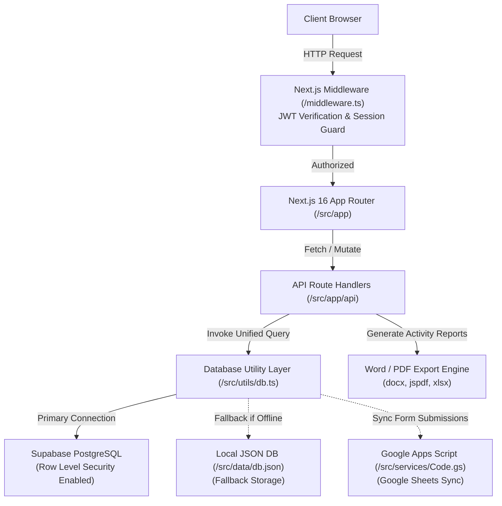
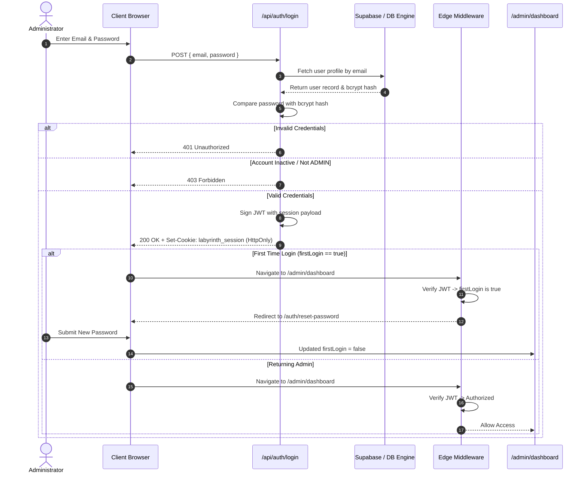
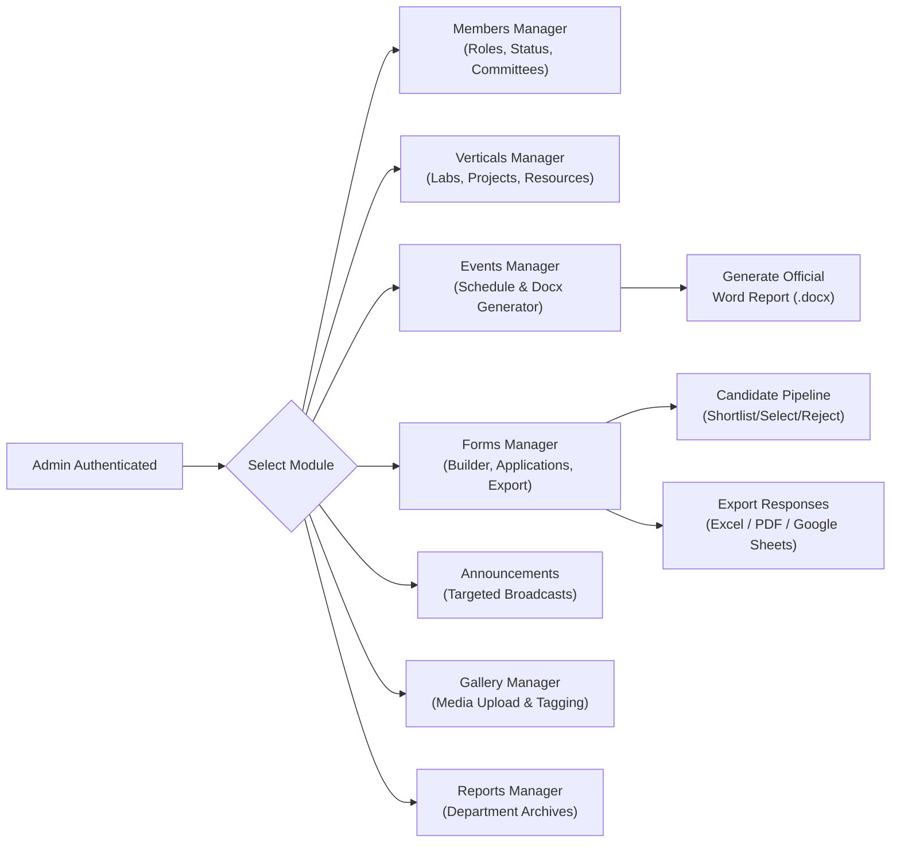

<div align="center">

  

  # LABYRINTH

  **The Official Computer Science Club Portal of Christ University**

  [](https://nextjs.org/)
  [](https://www.typescriptlang.org/)
  [](https://react.dev/)
  [](https://tailwindcss.com/)
  [](https://supabase.com/)
  [](https://vercel.com/)
  [](https://www.framer.com/motion/)
</div>

---

## Overview

**Labyrinth** is the official digital infrastructure and web platform for the Department of Computer Science Club at Christ University. Engineered with modern web technologies, Labyrinth bridges public outreach, student engagement, dynamic recruitment, technical laboratory showcases, and administrative governance under a unified platform.

### Key Goals & Objectives

- **Centralized Club Operations:** Provide student leads and faculty coordinators with a single administration suite for member management, event scheduling, task allocation, and announcement broadcasting.
- **Dynamic Recruitment & Form Builder:** Allow administrators to create custom application forms with dynamic field types, track applicant pipelines through status transitions, and evaluate candidate responses in real-time.
- **Automated Academic Reporting:** Automatically format and generate official Christ University `.docx` activity reports (complete with institutional headers, geotagged photo galleries, participant lists, and rapporteur sign-offs) for departmental archives.
- **High-Performance Showcase:** Display technical verticals, events, past hackathons, and interactive media galleries with custom dark-mode aesthetics, smooth animations, and optimized media delivery.
- **Resilient Dual-Data Architecture:** Feature an auto-failover hybrid data engine that operates seamlessly on Supabase PostgreSQL with Row Level Security (RLS), local JSON filesystem persistence (`db.json`), or Google Apps Script sync (`Code.gs`).

---

## Features

| Module | Sub-Feature | Description | Status |
| :--- | :--- | :--- | :--- |
| **Public Portal** | Hero Showcase | Interactive video player, particle background, stat counters, and smooth Lenis scrolling. | Production Ready |
| **Public Portal** | Verticals Showcase | Interactive scroll stacks and Magic Bento cards showcasing technical and non-technical labs. | Production Ready |
| **Public Portal** | Events Showcase | Dynamic grid for upcoming fests, workshops, and past events with category filtering. | Production Ready |
| **Public Portal** | Media Gallery | Masonry layout media showcase with orientation filters (landscape/portrait) and lightbox modal. | Production Ready |
| **Public Portal** | Department & Team | Spotlights for Faculty Coordinators, Mentors, Core Committee heads, and Vertical leads. | Production Ready |
| **Forms System** | Dynamic Builder | Form creation with custom fields (text, select, radio, checkbox, dates, file uploads). | Production Ready |
| **Forms System** | Application Engine | Public applicant portal hosted at dynamic routes (`/forms/[slug]`) with validation. | Production Ready |
| **Forms System** | Evaluation Pipeline | Candidate recruitment workflow (`pending` → `shortlisted` → `interview_scheduled` → `selected` / `rejected`). | Production Ready |
| **Forms System** | Data Export | One-click export of applicant responses to Microsoft Excel (`.xlsx`), PDF, and Google Sheets. | Production Ready |
| **Admin Suite** | Dashboard | Role-aware administrative control panel tailored for Faculty, Admins, and Committee Heads. | Production Ready |
| **Admin Suite** | Member Governance | User creation, role assignment (`ADMIN` / `MEMBER`), committee/vertical assignment, and status toggles. | Production Ready |
| **Admin Suite** | Automated Reports | `.docx` Activity Report generator conforming to official university formatting standards. | Production Ready |
| **Admin Suite** | Announcements | Targeted broadcasts scoped to the entire club, specific committees, or technical verticals. | Production Ready |
| **Admin Suite** | Task & Resources | Assignment of project tasks and educational resource links across committees and verticals. | Production Ready |
| **Data Engine** | Hybrid Storage | Auto-switching backend supporting Supabase PostgreSQL, local JSON file storage, and Apps Script. | Production Ready |
| **Security** | Auth & Middleware | JWT session tokens via HttpOnly cookies, bcrypt hashing, and mandatory first-login password change. | Production Ready |

---

## Tech Stack

| Category | Technology | Usage & Purpose |
| :--- | :--- | :--- |
| **Core Framework** | [Next.js 16](https://nextjs.org/) | App Router architecture, Server Components, API routes, dynamic rendering. |
| **UI Library** | [React 19](https://react.dev/) | Component architecture, hooks, state management, and concurrent rendering. |
| **Language** | [TypeScript 6](https://www.typescriptlang.org/) | End-to-end type safety across components, API routes, database models, and utilities. |
| **Styling** | [Tailwind CSS v4](https://tailwindcss.com/) | Modern utility-first CSS framework, custom theme design tokens, dark mode aesthetics. |
| **Database** | [Supabase](https://supabase.com/) | Managed PostgreSQL instance, authentication metadata, storage buckets, and RLS policies. |
| **Animation** | [Framer Motion](https://www.framer.com/motion/) | Smooth layout transitions, modal animations, and entrance effects. |
| **Animation** | [GSAP & @gsap/react](https://gsap.com/) | Timeline-based scroll triggers, scroll stacks, and card swap animations. |
| **Smooth Scroll** | [Lenis](https://lenis.darkroom.engineering/) | Inertial smooth scrolling engine integrated across all viewports. |
| **Icons** | [Lucide React](https://lucide.dev/) | Crisp, performant SVG icon library. |
| **Authentication** | [JOSE & bcryptjs](https://github.com/panva/jose) | JWT signing and verification, password hashing, and cookie management. |
| **Document Generation** | [docx](https://docx.js.org/) & [file-saver](https://github.com/eligrey/FileSaver.js/) | Programmatic Word document generation for official event reports. |
| **PDF & Data Export** | [jspdf](https://github.com/parallax/jsPDF) & [xlsx](https://sheetjs.com/) | Export form responses and administrative analytics to PDF and Excel files. |
| **Cloud Integration** | [Google Apps Script](https://developers.google.com/apps-script) | Google Sheets synchronization backend (`Code.gs`) for external submissions. |
| **Linter** | [Oxlint](https://oxc.rs/docs/guide/usage/linter.html) | High-performance JavaScript/TypeScript linter. |

---

## Architecture

Labyrinth uses a hybrid, multi-layered architecture where Next.js 16 App Router handles page requests, client components, and server API endpoints. Route protection is enforced at the edge via Next.js Middleware parsing signed JWT session cookies.



---

## Folder Structure

```
c:\projects\CS_labyrith\
├── src/
│   ├── app/                    # Next.js 16 App Router pages and API routes
│   │   ├── about/              # Department vision, mission, and leadership page
│   │   ├── access-denied/      # Unauthorized access notification page
│   │   ├── admin/              # Protected administrative dashboard sub-routes
│   │   │   ├── announcements/  # Announcement broadcast management
│   │   │   ├── dashboard/      # Role-aware admin overview page
│   │   │   ├── events/         # Events CRUD & docx report generator
│   │   │   ├── forms/          # Form builder & applicant evaluation pipeline
│   │   │   ├── gallery/        # Media gallery upload & categorization
│   │   │   ├── login/          # Administrator authentication entry point
│   │   │   ├── members/        # Club member profiles & role assignments
│   │   │   ├── reports/        # Activity report generation view
│   │   │   ├── settings/       # Account configuration & portal settings
│   │   │   ├── tasks/          # Task allocation and status management
│   │   │   └── verticals/      # Technical vertical lab management
│   │   ├── api/                # Next.js API endpoints
│   │   │   ├── auth/           # Login, logout, session, reset-password handlers
│   │   │   └── db/             # Unified database action controller route (/api/db)
│   │   ├── auth/               # First-login password reset page
│   │   ├── contact/            # Contact information & query submission page
│   │   ├── events/             # Public events catalogue page
│   │   ├── forms/              # Dynamic application form routes (/forms/[slug])
│   │   ├── gallery/            # Public media gallery page
│   │   ├── team/               # Faculty, mentor, and student leadership page
│   │   ├── verticals/          # Public technical verticals showcase page
│   │   ├── layout.tsx          # Root layout wrapper (Fonts, AuthProvider, Navbar, Footer)
│   │   ├── not-found.tsx       # Custom 404 page handler
│   │   └── page.tsx            # Home page router entry point
│   ├── components/             # Reusable UI layout & custom design components
│   │   ├── layout/             # Navbar, Footer, SmoothScroll, ScrollProgress wrappers
│   │   └── ui/                 # FlowingMenu, MagicBento, CardSwap, ScrollStack, StatCounter
│   ├── context/                # React Context Providers (AuthContext.tsx)
│   ├── data/                   # Fallback JSON datasets (db.json, team.json, events.json)
│   ├── hooks/                  # Custom hooks (useMediaQuery, usePrefetchOnIdle, useScrollAnimation)
│   ├── services/               # Google Apps Script integration (Code.gs, api.ts)
│   ├── utils/                  # Core system utilities
│   │   ├── constants.ts        # System constants & fallbacks
│   │   ├── db.ts               # Unified data engine (Supabase query & local JSON fallback)
│   │   ├── generateEventWordReport.ts # Automated Word document report generator
│   │   ├── jwt.ts              # JOSE JWT token generation & verification helpers
│   │   └── supabase.ts         # Supabase client & admin client initializers
│   ├── views/                  # Main page view components and admin manager panels
│   │   └── admin/              # Manager components (FormsManager, MembersManager, etc.)
│   ├── index.css               # Global CSS stylesheet & Tailwind theme directives
│   └── middleware.ts           # Next.js Edge Middleware for JWT session validation
├── public/                     # Static media assets, logos, and images
├── supabase_schema.sql         # Production PostgreSQL database schema & RLS policy script
├── next.config.js              # Next.js build configuration & security headers
├── package.json                # Project dependencies and script definitions
└── tsconfig.json               # TypeScript compiler configuration
```

---

## Authentication Flow

Labyrinth utilizes a secure authentication mechanism backed by HttpOnly session cookies, custom JWT verification in Edge middleware, and enforced first-login password updates.



---

## Database Schema

The database relies on a normalized PostgreSQL schema defined in `supabase_schema.sql`. Row Level Security (RLS) is enabled across all public tables to enforce public read access while restricting write, update, and delete actions exclusively to users with the `ADMIN` role.

```mermaid
erDiagram
    profiles ||--o{ core_committees : "heads"
    profiles ||--o{ verticals : "heads"
    profiles }|--|| core_committees : "belongs_to"
    profiles }|--|| verticals : "belongs_to"
    
    core_committees ||--o{ events : "hosts"
    verticals ||--o{ events : "hosts"
    
    profiles ||--o{ tasks : "assigned_to"
    core_committees ||--o{ tasks : "scoped_to"
    verticals ||--o{ tasks : "scoped_to"
    
    profiles ||--o{ resources : "uploaded_by"
    core_committees ||--o{ resources : "attached_to"
    verticals ||--o{ resources : "attached_to"
    
    profiles ||--o{ activity_logs : "triggers"
    
    forms ||--o{ form_fields : "contains"
    forms ||--o{ form_responses : "receives"
    form_responses ||--o{ response_answers : "stores"
    
    profiles {
        uuid id PK
        string email UK
        string full_name
        string role
        string status
        boolean first_login
        uuid committee_id FK
        uuid vertical_id FK
    }

    core_committees {
        uuid id PK
        string name
        string description
        uuid head_id FK
    }

    verticals {
        uuid id PK
        string name
        string category
        string color
        uuid head_id FK
    }

    events {
        uuid id PK
        string title
        date date
        string location
        uuid committee_id FK
        uuid vertical_id FK
    }

    forms {
        uuid id PK
        string title
        string slug UK
        string status
    }

    form_fields {
        uuid id PK
        uuid form_id FK
        string field_type
        string label
        boolean required
    }

    form_responses {
        uuid id PK
        uuid form_id FK
        string applicant_name
        string applicant_email
        string status
    }

    response_answers {
        uuid id PK
        uuid response_id FK
        uuid field_id FK
        jsonb value
    }
```



> [!NOTE]
> If Supabase credentials are missing or the database is offline, the unified database utility (`src/utils/db.ts`) seamlessly falls back to reading and persisting updates in the local JSON database (`src/data/db.json`).

---

## Installation

### Prerequisites

- **Node.js**: `v18.17.0` or higher
- **npm**: `v9.0.0` or higher (or `pnpm`/`yarn`)
- **Supabase Account** (Optional for local development mode)

### Step-by-Step Setup

1. **Clone the repository:**
   ```bash
   git clone https://github.com/sgk18/CS_labyrith.git
   cd CS_labyrith
   ```

2. **Install project dependencies:**
   ```bash
   npm install
   ```

3. **Configure Environment Variables:**
   Create a `.env.local` file in the root directory (refer to the [Environment Variables](#environment-variables) section below).

4. **Execute Database Setup (If using Supabase):**
   Copy the contents of `supabase_schema.sql` and run them inside your Supabase SQL Editor to initialize tables, triggers, and Row Level Security policies.

5. **Start the Development Server:**
   ```bash
   npm run dev
   ```
   Open [http://localhost:3000](http://localhost:3000) in your browser to view the application.

6. **Build for Production:**
   ```bash
   npm run build
   npm run start
   ```

---

## Environment Variables

Configure the following environment variables in your `.env.local` file:

| Variable | Required | Description |
| :--- | :---: | :--- |
| `NEXT_PUBLIC_SUPABASE_URL` | No* | URL endpoint of your Supabase project instance. |
| `NEXT_PUBLIC_SUPABASE_ANON_KEY` | No* | Public anonymous key for client-side Supabase queries. |
| `SUPABASE_SERVICE_ROLE_KEY` | No* | Secret service role key for administrative bypass operations. |
| `JWT_SECRET` | **Yes** | Secret cryptographic key used to sign and verify session JWTs. |
| `DEFAULT_TEMPORARY_PASSWORD` | **Yes** | Default initial password assigned to newly provisioned accounts. |
| `FORCE_LOCAL_DB` | No | Set to `true` to force the application to use the local `db.json` fallback. |
| `NEXT_PUBLIC_FORCE_LOCAL_DB` | No | Client-accessible flag to force local JSON file database mode. |
| `RESEND_API_KEY` | No | API key for automated email delivery via Resend. |

*\* If Supabase environment variables are omitted, Labyrinth automatically runs in local JSON database mode using `src/data/db.json`.*

> [!WARNING]
> Never commit sensitive secrets, service role keys, or database credentials to public source control.

---

## Performance Optimizations

Labyrinth incorporates several frontend and server performance enhancements:

- **Parallelized Data Fetching:** Administrative APIs leverage `Promise.all` execution for multi-table queries (cutting cold-start response latency from ~15s to ~5s).
- **Static Asset Cache Control:** `next.config.js` sets immutable long-term caching (`max-age=31536000, immutable`) for logos, static event media, and gallery images.
- **Route Prefetching on Idle:** Custom hook `usePrefetchOnIdle` prefetches high-traffic public pages during browser idle periods.
- **Font Optimization:** Next.js Google Fonts (`Space_Grotesk` and `Inter`) are pre-loaded and injected as CSS variables to prevent Layout Shift (CLS).
- **Remote Image Domain Rules:** Configured `images.remotePatterns` for secure and optimized image serving from Supabase Storage, Unsplash, and UI Avatars.
- **Dynamic Imports & Code Splitting:** Heavy administrative dialogs, docx document generators, and PDF export packages are dynamically imported only when triggered by user actions.

---

## UI Design System

Labyrinth features a distinct cyber-modern dark theme designed to provide a premium user experience:

- **Color Palette:** Deep obsidian background (`#0a0a0a`), dark slate card containers (`#121212`), crisp white typography (`#fcfcfc`), and signature brand crimson highlights (`#CD0000`).
- **Typography:** Display headings rendered in `Space Grotesk` paired with clean, readable `Inter` body text.
- **Interactive UI Components:**
  - **Magic Bento Grid:** Responsive bento grid layout with mouse-hover spotlight effects.
  - **Card Swap:** Animated card stack view powered by GSAP for displaying vertical spotlights.
  - **Flowing Menu:** Kinetic typography menu navigation with smooth hover triggers.
  - **Glassmorphism:** Subtle background blurs (`backdrop-blur-md`) applied to floating navbars and sticky modal headers.
- **Accessibility & Responsiveness:** Fully responsive layouts tailored for mobile viewports, tablets, and wide desktop displays with explicit keyboard navigation targets and ARIA tags.

---

## Admin Dashboard Workflow

The administrative portal (`/admin`) equips department leaders with a full suite of management capabilities:



---

## Custom Forms & Application System

Labyrinth features a custom-built form engine designed for student club recruitment drives and event registration campaigns:

1. **Form Creation:** Administrators construct custom forms with dynamic slugs (`/forms/recruitment-2026`), cover images, submission windows, and custom field types (text, single select, checkboxes, file links).
2. **Form Lifecycle:** Forms transition through controlled lifecycle states: `draft` → `published` → `closed` → `archived`.
3. **Application Intake:** Public users submit entries at `/forms/[slug]`. Submissions undergo validation before entry into `form_responses` and `response_answers`.
4. **Applicant Review Pipeline:** Reviewers evaluate incoming candidates using structured status steps:
   `Pending` → `Shortlisted` → `Interview Scheduled` → `Selected` / `Rejected`.
5. **Data Export:** Response datasets can be exported instantly to `.xlsx` workbooks, `.pdf` summaries, or synchronized to external Google Sheets via `Code.gs`.

---

## Automated Activity Report Generator

To fulfill Christ University departmental documentation standards, Labyrinth includes a client-side document generator (`src/utils/generateEventWordReport.ts`).

- **Official Styling:** Injects official Christ University and Labyrinth logos, structured header metadata tables, rapporteur contact details, event highlights, participant numbers, and key takeaways.
- **Geotagged Image Embedding:** Fetches event posters and geotagged event photo URLs, formatting them directly into high-resolution inline document tables.
- **One-Click Download:** Compiles and saves the finished report directly as a `.docx` file using `docx` and `file-saver`.

---

## Security & Governance

- **Edge Route Protection:** Next.js Edge Middleware inspects the `labyrinth_session` cookie on all `/admin/*` routes before rendering page markup.
- **Session Tokens:** Signed JWT tokens using `jose` contain user identity, role, and first-login state flags with strict 24-hour expiration.
- **Password Security:** All user passwords are salted and hashed using `bcryptjs`. Initial temporary passwords automatically force a mandatory reset on first login (`/auth/reset-password`).
- **Row Level Security (RLS):** Supabase PostgreSQL policies restrict database mutations exclusively to authenticated administrators while preserving public read availability.
- **Input Sanitization:** API payloads and database helper functions validate email formatting, role constraints, and form response payloads.

---

## Roadmap

- [x] Next.js 16 App Router migration & Tailwind CSS v4 implementation.
- [x] Dual-storage engine (Supabase PostgreSQL with fallback to local JSON database).
- [x] Dynamic Form Builder with recruitment candidate review pipeline.
- [x] Automated `.docx` Event Activity Report generator for department archives.
- [x] Role-based Edge middleware authorization and password reset workflows.
- [ ] Push notification integration for targeted member announcements.
- [ ] QR-code event attendance scanner for live workshops and hackathons.
- [ ] Student portfolio showcase page for vertical project repositories.

---

## Contributing

We welcome contributions from students, faculty, and open-source enthusiasts!

1. Fork the repository on GitHub.
2. Create a feature branch (`git checkout -b feature/amazing-feature`).
3. Commit your changes with descriptive messages (`git commit -m 'Add amazing feature'`).
4. Push to your branch (`git checkout -b feature/amazing-feature` → `git push origin feature/amazing-feature`).
5. Open a Pull Request for review.

---

## License

Distributed under the [MIT License](LICENSE). See `LICENSE` for more information.

---

## Credits & Acknowledgements

Developed and maintained by the **Department of Computer Science Club (Labyrinth)** at Christ University.

- **Institution:** Christ University, Bangalore
- **Department:** Department of Computer Science
- **Platform Architecture & Development Lead:** Suryachalam VM & The Labyrinth Tech Team
